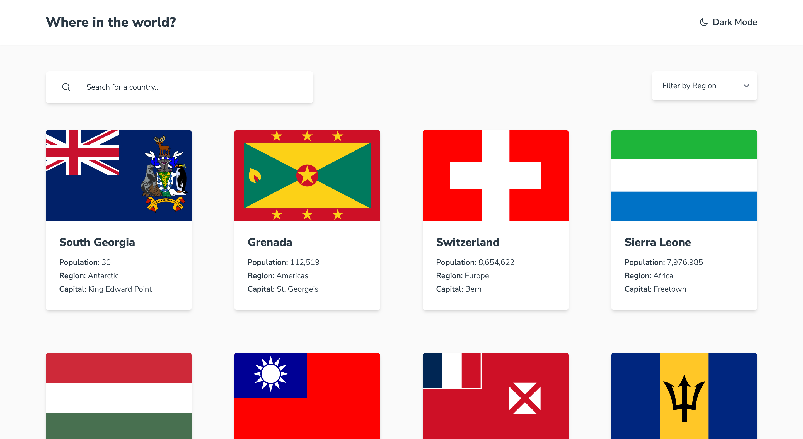

# Frontend Mentor - REST Countries API

This is a solution to the [REST Countries API challenge on Frontend Mentor](https://frontendmentor.io/challenges/rest-countries-api-with-color-theme-switcher-5cacc469fec04111f7b848ca). Frontend Mentor challenges help you improve your coding skills by building realistic projects.

## Table of contents

- [Overview](#overview)
  - [The challenge](#the-challenge)
  - [Screenshot](#screenshot)
  - [Links](#links)
- [My process](#my-process)
  - [Built with](#built-with)
  - [What I learned](#what-i-learned)
  - [Continued development](#continued-development)
  - [Useful resources](#useful-resources)
- [Author](#author)

## Overview

### The challenge

The challenge is to integrate with the [REST Countries API](https://restcountries.com) to pull country data and display it like in the designs.

Your users should be able to:

- See all countries from the API on the homepage
- Search for a country using an `input` field
- Filter countries by region
- Click on a country to see more detailed information on a separate page
- Click through to the border countries on the detail page
- Toggle the color scheme between light and dark mode _(optional)_

### Screenshot

### Links

- Solution URL: [View on Netlify](https://fem-rest-countries-api-seanhillweb.netlify.app/)
- Project URL: [View on Github](https://github.com/seanhillweb/frontend-mentor-rest-countries-api)

## My process

### Built with

- [React](https://reactjs.org/)
- [React Hook Forms](https://www.react-hook-form.com/)
- [Next.js](https://nextjs.org/)
- [Tailwind CSS](https://tailwindcss.com/)
- [Next Themes](https://github.com/pacocoursey/next-themes)
- [Axios](https://axios-http.com/)

### What I learned

Two major concepts stand out with this project. The first being how to work with API endpoints. I chose Axios as my library to manage HTTP request; and I found it easy to implement and manage. The syntax is simple and easy to read.

The second concept is manipulating the list of Countries inside the `.map()` - it's as easy as applying `.filter()` and creating your conditions for display. An enhancement I would like to try and refine in the future is including API endpoints to achieve a similar result.

### Continued development

Something I would be interested in develop further would be adding a "Load more" pagination. Seeing all of the countries at once could be a performance issue, and I think it would be better user experience to include pagination. I already implemented a lot of new patterns with the project, and I thought including that would be overload.

I also wanted to push my development skills and setup a Context Provider and Reducer. I've used this development pattern in the past, but I was having issues implementing the filter functionality.

### Useful resources

- [Simplify your Javascript - Use .map(), .reduce(), and .filter()](https://medium.com/poka-techblog/simplify-your-javascript-use-map-reduce-and-filter-bd02c593cc2d) - A short and effective article outline the use cases for `.map()` and `.filter()` in Javascript.

## Author

- Website - [Sean Hill](https://www.seanhillweb.com)
- Frontend Mentor - [@seanhillweb](https://www.frontendmentor.io/profile/seanhillweb)
